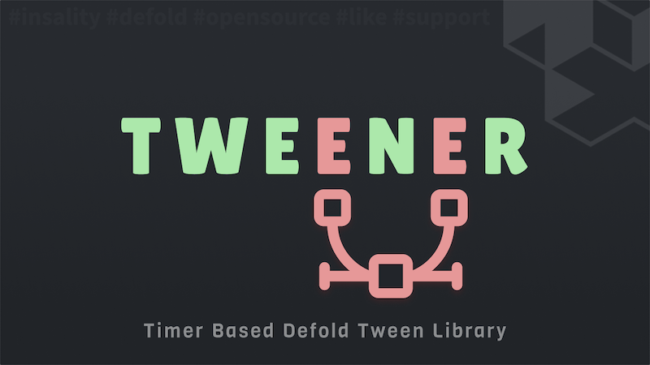

[](https://github.com/Insality/defold-tweener/tags)
[](https://github.com/Insality/defold-tweener/actions)
[](https://codecov.io/gh/Insality/defold-tweener)

[](https://github.com/sponsors/insality) [](https://ko-fi.com/insality) [](https://www.buymeacoffee.com/insality)


# Tweener

**Tweener** - is a single file Lua module for the [Defold](https://defold.com/) game engine. It provides a way to handle manual tweening in your game.

## Features

- **Tweening**: Create tweens for any action your want.
- **Easing Functions**: Provides a set of easing functions for different types of easings.
- **Custom Update Frequency**: Option to define update frequency for the tween.
- **Callbacks**: Callbacks for each tween update.
- **Custom Easings**: Support for custom easing functions.

## Setup

### [Dependency](https://www.defold.com/manuals/libraries/)

Open your `game.project` file and add the following line to the dependencies field under the project section:

**[Tweener](https://github.com/Insality/defold-tweener/archive/refs/tags/3.zip)**

```
https://github.com/Insality/defold-tweener/archive/refs/tags/3.zip
```

### Library Size

> **Note:** The library size is calculated based on the build report per platform

| Platform         | Library Size |
| ---------------- | ------------ |
| HTML5            | **3.28 KB**  |
| Desktop / Mobile | **6.21 KB**  |


### Global Update Frequency

Optionally, you can setup global default update frequency in your game.project. It's `60` by default.

Add next `tweener` section to your `game.project` in text mode:

```ini
[tweener]
update_frequency = 60
```

## API Reference

### Quick API Reference

```lua
-- Tween function can be a string, a predefined easing function, or a custom easing function
local tween_function = "linear" or tweener.linear or go.EASING_LINEAR or gui.EASING_LINEAR or {0, 0.2, 0.4, 0.8, 0.9, 1}

tweener.tween(tween_function, from, to, time, callback, [dt])
tweener.ease(tween_function, from, to, time, time_elapsed)
```

### Importing the Module

To start using the Tweener module in your project, you first need to import it. This can be done with the following line of code:

```lua
local tweener = require("tweener.tweener")
```

### Functions

The Tweener module provides two primary functions to work with tweens:

**tweener.tween**
---
```lua
tweener.tween(tween_function, from, to, time, callback, [dt])
```

This function initiates a tween operation immediately. Here's how to use it:

- **Parameters:**
  - `tween_function`: The tween function. You can use one of the predefined easing functions or provide a custom one.
  - `from`: The starting value of the tween.
  - `to`: The ending value of the tween.
  - `time`: The duration of the tween, in seconds.
  - `callback`: A `function(value, is_final_call)` that gets called upon each update of the tween.
  - `dt` (optional): The time interval for updating the tween, in seconds.

- **Return Value:**
  - `tweener_id`: A tweener id from `timer.delay` if you wish to cancel the tween.

- **Usage Example:**

```lua
tweener.tween(tweener.linear, 0, 100, 1.5, function(value, is_final_call)
	print("Tween value: " .. value)
end)

tweener.tween(go.EASING_OUTSINE, 0, 100, 1.5, function(value, is_final_call)
	print("Tween value: " .. value)
end)

local tween_id = tweener.tween({0, 0.2, 0.4, 0.8, 0.9, 1}, 0, 100, 1.5, function(value, is_final_call)
	print("Tween value: " .. value)
end)

-- You can cancel the tween by calling tweener.cancel
tweener.cancel(tween_id)
```


**tweener.ease**
---
```lua
tweener.ease(tween_function, from, to, time, time_elapsed)
```

This function calculates the value of the tween at a specific point in time, based on the easing function provided.

- **Parameters:**
  - `tween_function`: The tween function.
  - `from`: The starting value of the tween.
  - `to`: The ending value of the tween.
  - `time`: The total duration of the tween, in seconds.
  - `time_elapsed`: The elapsed time since the start of the tween, in seconds.

- **Usage Example:**

```lua
local value = tweener.ease(tweener.inquad, 0, 100, 1.5, 0.75)
print("The tween value at halfway point is: ", value)

local value = tweener.ease(gui.EASING_OUTSINE, 0, 100, 1.5, 0.75)
print("The tween value at halfway point is: ", value)

local value = tweener.ease({0, 0.2, 0.4, 0.8, 0.9, 1}, 0, 100, 1.5, 0.75)
print("The tween value at halfway point is: ", value)
```

These functions provide a flexible and powerful way to add animations and transitions to your projects, making them feel more dynamic and engaging. Enjoy animating with the **Tweener** module! *(Thanks, Mister ChatGPT)* 🙃


## Tween Functions

| Tweener Constant | Defold Constant | Easing |
|------------------|-----------------|--------|
| `tweener.linear` | `go.EASING_LINEAR` |  |
| `tweener.insine` | `go.EASING_INSINE` |  |
| `tweener.inquad` | `go.EASING_INQUAD` |  |
| `tweener.incubic` | `go.EASING_INCUBIC` |  |
| `tweener.incirc` | `go.EASING_INCIRC` |  |
| `tweener.inquart` | `go.EASING_INQUART` |  |
| `tweener.inquint` | `go.EASING_INQUINT` |  |
| `tweener.inexpo` | `go.EASING_INEXPO` |  |
| `tweener.inback` | `go.EASING_INBACK` |  |
| `tweener.inelastic` | `go.EASING_INELASTIC` |  |
| `tweener.inbounce` | `go.EASING_INBOUNCE` |  |
| `tweener.outsine` | `go.EASING_OUTSINE` |  |
| `tweener.outquad` | `go.EASING_OUTQUAD` |  |
| `tweener.outcubic` | `go.EASING_OUTCUBIC` |  |
| `tweener.outcirc` | `go.EASING_OUTCIRC` |  |
| `tweener.outquart` | `go.EASING_OUTQUART` |  |
| `tweener.outquint` | `go.EASING_OUTQUINT` |  |
| `tweener.outexpo` | `go.EASING_OUTEXPO` |  |
| `tweener.outback` | `go.EASING_OUTBACK` |  |
| `tweener.outelastic` | `go.EASING_OUTELASTIC` |  |
| `tweener.outbounce` | `go.EASING_OUTBOUNCE` |  |
| `tweener.inoutsine` | `go.EASING_INOUTSINE` |  |
| `tweener.inoutquad` | `go.EASING_INOUTQUAD` |  |
| `tweener.inoutcubic` | `go.EASING_INOUTCUBIC` |  |
| `tweener.inoutcirc` | `go.EASING_INOUTCIRC` |  |
| `tweener.inoutquart` | `go.EASING_INOUTQUART` |  |
| `tweener.inoutquint` | `go.EASING_INOUTQUINT` |  |
| `tweener.inoutexpo` | `go.EASING_INOUTEXPO` |  |
| `tweener.inoutback` | `go.EASING_INOUTBACK` |  |
| `tweener.inoutelastic` | `go.EASING_INOUTELASTIC` |  |
| `tweener.inoutbounce` | `go.EASING_INOUTBOUNCE` |  |
| `tweener.outinsine` | `go.EASING_OUTINSINE` |  |
| `tweener.outinquad` | `go.EASING_OUTINQUAD` |  |
| `tweener.outincubic` | `go.EASING_OUTINCUBIC` |  |
| `tweener.outincirc` | `go.EASING_OUTINCIRC` |  |
| `tweener.outinquart` | `go.EASING_OUTINQUART` |  |
| `tweener.outinquint` | `go.EASING_OUTINQUINT` |  |
| `tweener.outinexpo` | `go.EASING_OUTINEXPO` |  |
| `tweener.outinback` | `go.EASING_OUTINBACK` |  |
| `tweener.outinelastic` | `go.EASING_OUTINELASTIC` |  |
| `tweener.outinbounce` | `go.EASING_OUTINBOUNCE` |  |


## Usage

You can use Tweener to animate scoring text, for example:


This animation can be created using the following code:

```lua
tweener.tween(gui.EASING_OUTCIRC, 0, 9999, 2.4, function(value, is_final_call)
	gui.set_text(text_score, "Score: " .. math.floor(value))

	if is_final_call then
		gui.set_scale(text_score, vmath.vector3(1.25, 1.25, 1))
		gui.animate(text_score, "scale", vmath.vector3(1, 1, 1), gui.EASING_OUTBOUNCE, 0.5)
	end
end)
```

You can obtain the value of the tween at any point in time with the `tweener.ease` function:

```lua
tweener.ease(gui.EASING_OUTSINE, 0, 100, 1, 0)    -- Returns 0
tweener.ease(gui.EASING_OUTSINE, 0, 100, 1, 0.25) -- Returns 38.268343236509
tweener.ease(gui.EASING_OUTSINE, 0, 100, 1, 0.5)  -- Returns 70.710678118655
tweener.ease(gui.EASING_OUTSINE, 0, 100, 1, 0.75) -- Returns 92.387953251129
tweener.ease(gui.EASING_OUTSINE, 0, 100, 1, 1)    -- Returns 100
```


## License

This project is licensed under the MIT License - see the LICENSE file for details.


## Issues and suggestions

If you have any issues, questions or suggestions please [create an issue](https://github.com/Insality/defold-tweener/issues).


## 👏 Contributors

<a href="https://github.com/Insality/defold-tweener/graphs/contributors">
  
</a>


## Changelog

### **V1**
<details>
	<summary><b>Changelog</b></summary>

	- Initial release
</details>


### **V2**
<details>
	<summary><b>Changelog</b></summary>

	- Changed timer `delta time` to `socket.gettime` for more precise tweening
</details>


### **V3**
<details>
	<summary><b>Changelog</b></summary>

	- Added custom easings support
</details>


## ❤️ Support project ❤️

Your donation helps me stay engaged in creating valuable projects for **Defold**. If you appreciate what I'm doing, please consider supporting me!

[](https://github.com/sponsors/insality) [](https://ko-fi.com/insality) [](https://www.buymeacoffee.com/insality)
